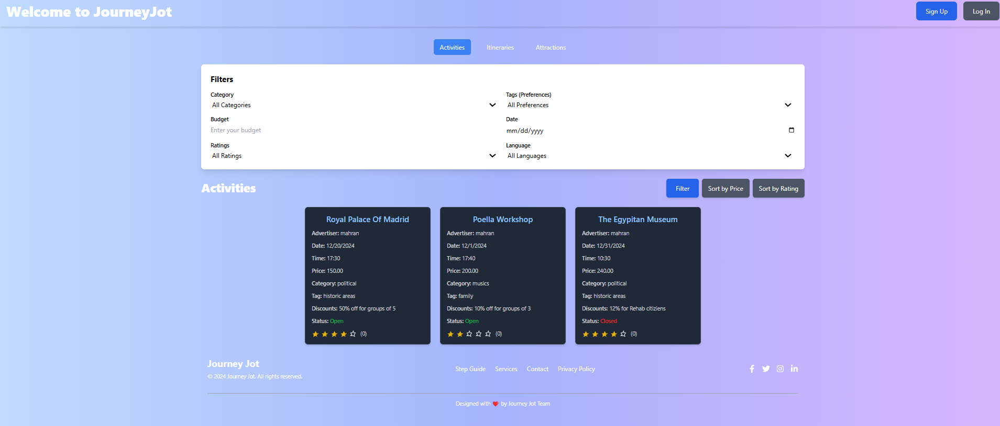
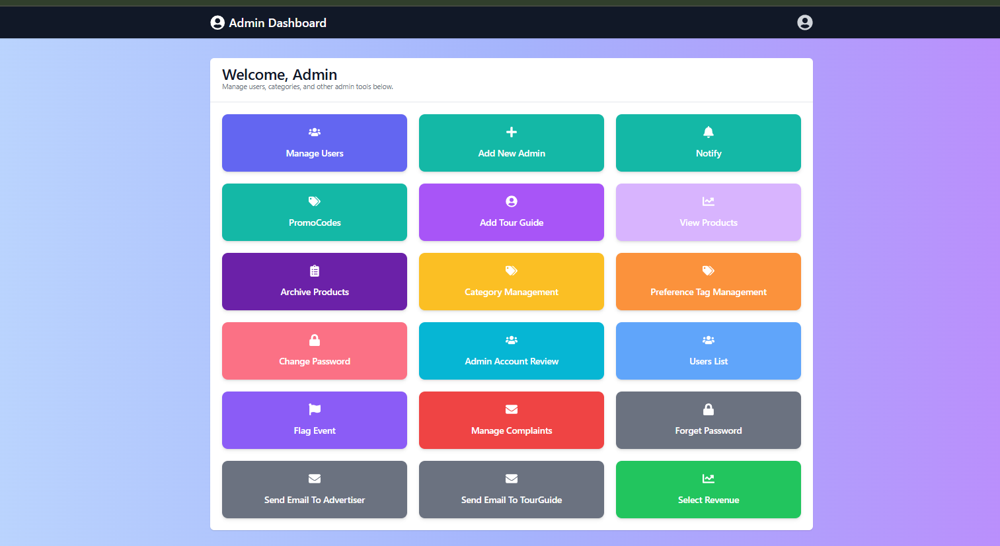
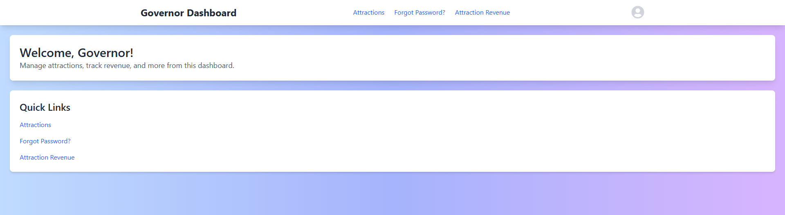
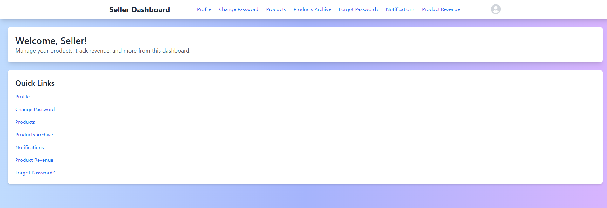
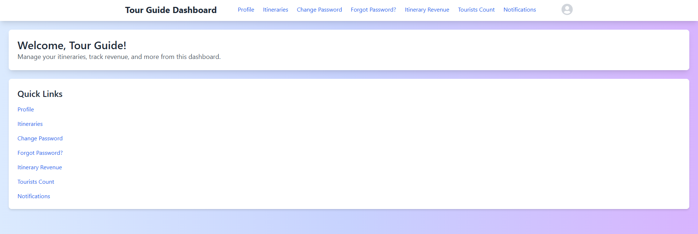
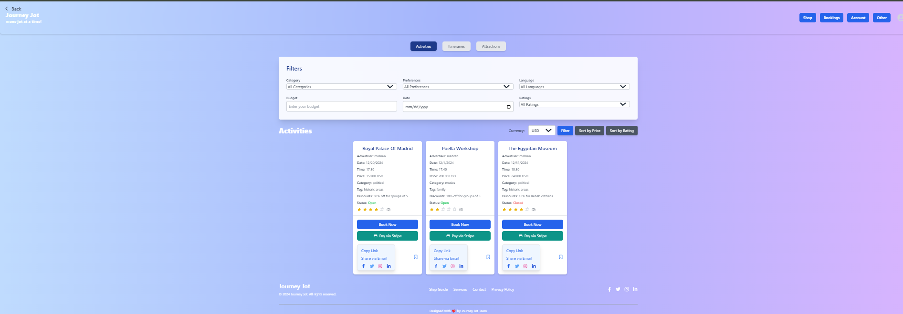

# JourneyJot


 ![GitHub issues]

**German University in Cairo**  
**Media Engineering and Technology**  
**Winter 2024**

**Project Grade:** 85%  
**Report Grade:** 10%

---

## Table of Contents

- [Project Title](#project-title)
- [Motivation](#motivation)
- [Code Style](#code-style)
- [Screenshots](#screenshots)
- [Tech/Framework Used](#techframework-used)
- [Features](#features)
- [Code Examples](#code-examples)
- [Installation](#installation)
- [API References](#api-references)
- [Tests](#tests)
- [How to Use](#how-to-use)
- [Roadmap](#roadmap)
- [FAQ](#faq)
- [Contribute](#contribute)
- [Credits](#credits)
- [License](#license)

---

## Project Title

**JourneyJot**

---

## Motivation

JourneyJot is designed to revolutionize vacation planning by offering an all-in-one platform that allows users to personalize their trips, make seamless bookings, manage budgets, discover local attractions, and receive real-time notifications. Our mission is to enhance the travel experience by integrating essential services into a single, intuitive application, making travel planning effortless and enjoyable.

---

## Build Status


---

## Code Style

JourneyJot adheres to the [Airbnb JavaScript Style Guide](https://github.com/airbnb/javascript) to ensure consistency and readability throughout the codebase. ESLint and Prettier are configured to automatically enforce these standards.

---

## Screenshots

### Home Page

[](./Screenshots/HomePage.png)  
*Home Page showcasing featured attractions and itineraries.*

### Admin Page

[](./Screenshots/AdminPage.png)  
*Admin dashboard for managing users, categories, and preferences.*

### Advertiser Page

[](./Screenshots/AdvertiserPage.png)  
*Advertiser dashboard for creating and managing activities.*

### Governor Page

[](./Screenshots/GovernorPage.png)  
*Governor dashboard for managing attractions and viewing revenues.*

### Seller Page

[](./Screenshots/SellerPage.png)  
*Seller dashboard for managing products and viewing product revenue.*

### Tour Guide Page

[](./Screenshots/TourguidePage.png)  
*Tour Guide dashboard for creating and managing itineraries.*

### Tourist Page

[](./Screenshots/TouristPage.png)  
*Tourist dashboard for browsing attractions, booking trips, and managing reservations.*

---

## Tech/Framework Used

- **Frontend:**
  - React.js
  - React Router DOM
  - Tailwind CSS
  - Axios
  - React Icons
  - React Toastify
  - Stripe.js & React Stripe.js

- **Backend:**
  - Node.js
  - Express.js
  - MongoDB
  - JWT Authentication

- **Testing:**
  - Jest
  - Postman

---

## Features

### User Roles

- **Tourist:** Browse attractions, book itineraries, manage reservations, view purchase history, and manage wallet and points.
- **Tour Guide:** Create and manage itineraries, view completed itineraries, and manage profile.
- **Advertiser:** Create and manage activities, view activity revenue, and manage profile.
- **Seller:** Manage products, view product revenue, and handle seller-specific notifications.
- **Administrator:** Manage users, categories, preference tags, review documents, handle complaints, and oversee revenue.
- **Governor:** Manage attractions, view attraction revenue, and handle governor-specific notifications.

### Key Functionalities

- **Personalized Travel Planning:** Tailor vacations based on preferences like historic sites, beaches, shopping, and budget.
- **Seamless Booking:** Book flights, hotels, and transportation directly within the app through trusted third-party services.
- **Smart Budgeting:** Receive activity suggestions that fit the remaining budget after booking flights and hotels.
- **Discover Local Gems:** Explore curated activities, museums, and historical landmarks with ticket prices and directions.
- **Real-Time Notifications:** Stay updated on upcoming events and booked activities with instant app and email alerts.
- **Tour Guides Itineraries:** Find expert-guided tours or create customizable itineraries with detailed activity breakdowns.
- **Exclusive Gift Shop:** Access an in-app gift shop for souvenirs and unique local items.
- **Wallet & Points Management:** Manage wallet balance and track points earned through activities and bookings.
- **Admin Controls:** Extensive dashboard for managing users, categories, preferences, and handling revenue reports.

---

## Code Examples

### Stripe Payment Integration

```jsx
import { CardElement, useStripe, useElements } from '@stripe/react-stripe-js';
import { toast } from 'react-toastify';
import axios from 'axios';
import { useNavigate } from 'react-router-dom';

const handlePayment = async (e) => {
  e.preventDefault();
  setIsLoading(true);

  if (!stripe || !elements) {
    toast.error('Stripe has not loaded yet. Please try again later.');
    setIsLoading(false);
    return;
  }

  try {
    const { error, paymentMethod } = await stripe.createPaymentMethod({
      type: 'card',
      card: elements.getElement(CardElement),
    });

    if (error) {
      toast.error(`Payment Method Error: ${error.message}`);
      setPaymentStatus(`Payment failed: ${error.message}`);
      setIsLoading(false);
      return;
    }

    // Proceed with payment processing
    const response = await axios.post('/tourists/pay-stripe-itinerary', {
      // payment data
    });

    toast.success('Payment was successful!');
    navigate('/tourist/homePage');
  } catch (error) {
    toast.error('Payment failed! Please try again.');
  } finally {
    setIsLoading(false);
  }
};
Fetching Cart Items
jsx
Copy code
import { useEffect, useState } from 'react';
import axios from 'axios';
import { toast } from 'react-toastify';

const CartComponent = () => {
  const [cart, setCart] = useState([]);
  const [totalCost, setTotalCost] = useState(0);

  useEffect(() => {
    const fetchCart = async () => {
      try {
        const response = await axios.get('/tourists/getCart', {
          headers: {
            Authorization: `Bearer ${localStorage.getItem('token')}`,
          },
        });
        setCart(response.data.cart || []);
        setTotalCost(
          response.data.cart.reduce(
            (total, item) => total + item.quantity * item.productId.price,
            0
          )
        );
      } catch (error) {
        toast.error('Failed to fetch cart. Please try again.');
      }
    };

    if (cart.length === 0) {
      fetchCart();
    }
  }, [cart]);

  return (
    <div>
      {/* Cart UI Components */}
    </div>
  );
};
Installation
Prerequisites
Node.js (v14 or later)
npm or yarn
MongoDB (if setting up the backend locally)
Stripe Account (for payment processing)
Steps
Clone the Repository

bash
Copy code
git clone https://github.com/yourusername/JourneyJot.git
cd JourneyJot
Install Dependencies

bash
Copy code
npm install
# or
yarn install
Set Up Environment Variables

Create a .env file in the root directory and add the following:

env
Copy code
REACT_APP_STRIPE_PUBLIC_KEY=your_stripe_public_key
REACT_APP_API_URL=http://localhost:3000
Alternatively, you can copy the provided example:

bash
Copy code
cp .env.example .env
Tip: Create a .env.example file with placeholder values to guide users without exposing sensitive information.

Run the Application

bash
Copy code
npm start
# or
yarn start
Backend Setup

Ensure the backend server is running and accessible at the URL specified in REACT_APP_API_URL.

Note: Follow the backend setup instructions provided in the Backend Documentation.

API References
General Routes
/ - Tourist Guest Page
/home-page - Home Page
/login - User Login
/signup - User Signup
Tourist Routes
/tourist-signup - Tourist Signup
/tourist-login - Tourist Login
/tourist/homePage - Tourist Home Page
/tourist/homePage/profile - Tourist Profile
/tourist/homePage/products - Tourist Products
/tourist/homePage/change-password - Change Password
/tourist/homePage/complaints - Tourist Complaints Page
/tourist/homePage/reservations - Tourist Reservations
/tourist/homePage/bookmarks - Bookmarks
/tourist/homePage/products/:id - Full Product Page
/tourist/homePage/products/purchase-history - Purchase History
/tourist/homePage/products/wishlist - Wishlist
/tourist/homePage/products/cart - Tourist Cart
/tourist/homePage/wallet - Tourist Wallet
/tourist/homePage/points - Tourist Points
/tourist/homePage/transportation - Transportation
/tourist/homePage/flights - Flight Search
/tourist/homePage/hotels - Hotel List
/tourist-address - Address Management
/tourist-orders - Previous Purchases
/tourist-cart - Tourist Cart
/buy-tourist-cart - Buy Tourist Cart
/tourist/homePage/promo-codes - Promo Codes
/tourist-notifications - Tourist Notifications
/tourist-itinerary-notifications - Tourist Itinerary Notifications
Tour Guide Routes
/tour-guide/profile - Tour Guide Profile
/tour-guide-dashboard - Tour Guide Dashboard
/tour-guide-dashboard/profile - Tour Guide Profile
/tour-guide-dashboard/itineraries - Itineraries
/tour-guide-dashboard/change-password - Change Password
/completed/itineraryDetails/:id - Completed Itinerary Info
/completed/tourGuideDetails/:id - Tour Guide Details
/itineraries/:id - Shared Itinerary Page
Advertiser Routes
/advertiser-dashboard - Advertiser Dashboard
/advertiser-dashboard/profile - Advertiser Profile
/advertiser-dashboard/activities - Create Activity
/advertiser-dashboard/activities/all-activities - Activities Page
/advertiser-dashboard/change-password - Change Password
/advertiser-dashboard/transportation - Create Transportation
/advertiser-dashboard/activity-revenue - Activity Revenue
/activities/:id - Shared Activity Page
Seller Routes
/seller-dashboard - Seller Dashboard
/seller-dashboard/profile - Seller Profile
/seller-dashboard/change-password - Change Password
/seller-dashboard/product-revenue - Product Revenue
/notify-seller-product - Notify Seller Product
Administrator Routes
/admins - Admin Dashboard
/admins/addAdmin - Add Admin
/admins/addGovernor - Add Governor
/admins/deleteUser - Admin Delete User
/admins/category-management - Category Management
/admins/preference-tag-management - Preference Tag Management
/admins/change-password - Admin Change Password
/admins/admin-account-review - Admin Document Review
/admins/view-users - User List
/admins/flag-events - Flag Events
/admins/complaints - Complaints Admin
/create-promocode - Promo Code Form
/notify-admin-product - Notify Admin Product
/send-email-advertiser - Send Email to Advertiser
/send-email-tour-guide - Send Email to Tour Guide
Governor Routes
/tourism-governor - Tourism Governor Dashboard
/Governor - Governor Dashboard
/tourism-governor/attraction-revenue - Attraction Revenue
Payment Routes
/pay-activity-stripe - Pay Activity with Stripe
/pay-itinerary-stripe - Pay Itinerary with Stripe
/pay-product-stripe - Pay Product with Stripe
Other Routes
/step-guide - Vacation Guide
/count-tourists-activities - Completed Activities
/count-tourists-itineraries - Completed Itineraries
/display-notification-activity - Display Notification Activity
/display-notification-itinerary - Display Notification Itinerary
For detailed API documentation, refer to the Backend Documentation.

Tests
Running Tests
JourneyJot uses Jest for unit testing and Postman for API testing.

Unit Tests

bash
Copy code
npm test
# or
yarn test
API Tests

Import the Postman collection found in ./postman/collection.json into Postman and run the predefined tests.

How to Use
Sign Up/Login

Navigate to /signup to create a new account.
Choose the appropriate role (Tourist, Tour Guide, Advertiser, Seller, Administrator, Governor).
Login via /login.
Tourist Features

Browse attractions and itineraries.
Add items to the cart or wishlist.
Book itineraries and manage reservations.
Make payments using Visa or other payment methods integrated with Stripe.
Manage wallet balance and track points earned.
Tour Guide Features

Create and manage itineraries.
View completed itineraries.
Manage profile and change password.
Advertiser Features

Create and manage activities.
View activity revenue.
Manage profile and change password.
Handle transportation services.
Seller Features

Manage products and view product revenue.
Handle seller-specific notifications.
Manage profile and change password.
Administrator Features

Manage users, categories, preference tags.
Review documents and handle complaints.
Oversee revenue and generate reports.
Send emails to advertisers and tour guides.
Manage promo codes.
Governor Features

Manage attractions and view attraction revenue.
Handle governor-specific notifications.
Payment Processing

Use the integrated Stripe payment gateway to securely process transactions.
Navigate to payment pages such as /pay-itinerary-stripe to complete purchases.
Roadmap
 Implement user reviews and ratings
 Add multi-language support
 Integrate social media sharing
 Enhance mobile responsiveness
 Develop advanced analytics dashboard
FAQ
Q: How do I reset my password?
A: Navigate to /tourist/homePage/change-password to reset your password.

Q: Can I use JourneyJot without creating an account?
A: Yes, you can browse as a guest, but some features require an account.

Q: How secure is my payment information?
A: JourneyJot uses Stripe for payment processing, ensuring secure transactions and data protection.

Q: Who do I contact for support?
A: Please open an issue in the Issue Tracker for any support or queries.

Contribute
Contributions are welcome! Please follow these steps:

Fork the Repository

Create a Feature Branch

bash
Copy code
git checkout -b feature/YourFeature
Commit Your Changes

bash
Copy code
git commit -m "Add your feature"
Push to the Branch

bash
Copy code
git push origin feature/YourFeature
Open a Pull Request

Provide a detailed description of your changes and submit the pull request for review.

Tip: Review the Contributing Guidelines for more details.

Credits
React.js - Frontend Library
Express.js - Backend Framework
MongoDB - Database
Stripe - Payment Processing
Tailwind CSS - Utility-First CSS Framework
React Toastify - Notification Library
React Icons - Icon Library
Jest - Testing Framework
Postman - API Testing Tool
Airbnb JavaScript Style Guide - Code Style Reference
License
This project is licensed under the Apache 2.0 License.
