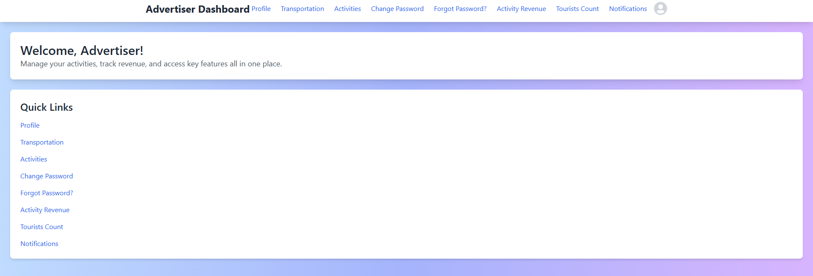

# Virtual Trip Planner

## Table of Contents

- [Project Title](#project-title)
- [Motivation](#motivation)
- [Build Status](#build-status)
- [Code Style](#code-style)
- [Screenshots](#screenshots)
- [Tech/Framework Used](#techframework-used)
- [Features](#features)
- [Code Examples](#code-examples)
- [Installation](#installation)
- [API References](#api-references)
- [Tests](#tests)
- [How to Use](#how-to-use)
- [Contribute](#contribute)
- [Credits](#credits)
- [License](#license)

## Project Title

**Virtual Trip Planner**

## Motivation

The Virtual Trip Planner is designed to simplify vacation planning by providing an all-in-one platform where users can personalize their trips, make seamless bookings, manage budgets, discover local attractions, and receive real-time notifications. Our goal is to enhance the travel experience by integrating essential services into a single, user-friendly application.

## Build Status


## Code Style

This project follows the [Airbnb JavaScript Style Guide](https://github.com/airbnb/javascript) to ensure consistency and readability across the codebase. ESLint and Prettier are configured to enforce these standards.

## Screenshots

### Home Page
[](./Screenshots/HomePage.png)
*Home Page showcasing featured attractions and itineraries.*

### Admin Page
[](./Screenshots/AdminPage.png)
*Admin dashboard for managing users, categories, and preferences.*

### Advertiser Page
[](./Screenshots/AdvertiserPage.png)
*Advertiser dashboard for creating and managing activities.*

### Governor Page
[](./Screenshots/GovernorPage.png)
*Governor dashboard for managing attractions and viewing revenues.*

### Seller Page
[](./Screenshots/SellerPage.png)
*Seller dashboard for managing products and viewing product revenue.*

### Tour Guide Page
[](./Screenshots/TourguidePage.png)
*Tour Guide dashboard for creating and managing itineraries.*

### Tourist Page
[](./Screenshots/TouristPage.png)
*Tourist dashboard for browsing attractions, booking trips, and managing reservations.*

## Tech/Framework Used

- **Frontend:**
  - React.js
  - React Router DOM
  - Tailwind CSS
  - Axios
  - React Icons
  - React Toastify
  - Stripe.js & React Stripe.js

- **Backend:**
  - Node.js
  - Express.js
  - MongoDB
  - JWT Authentication

- **Testing:**
  - Jest
  - Postman

## Features

### User Roles

- **Tourist:** Browse attractions, book itineraries, manage reservations, view purchase history, and manage wallet and points.
- **Tour Guide:** Create and manage itineraries, view completed itineraries, and manage profile.
- **Advertiser:** Create and manage activities, view activity revenue, and manage profile.
- **Seller:** Manage products, view product revenue, and handle seller-specific notifications.
- **Administrator:** Manage users, categories, preference tags, review documents, handle complaints, and oversee revenue.
- **Governor:** Manage attractions, view attraction revenue, and handle governor-specific notifications.

### Key Functionalities

- **Personalized Travel Planning:** Tailor vacations based on preferences like historic sites, beaches, shopping, and budget.
- **Seamless Booking:** Book flights, hotels, and transportation directly within the app through trusted third-party services.
- **Smart Budgeting:** Receive activity suggestions that fit the remaining budget after booking flights and hotels.
- **Discover Local Gems:** Explore curated activities, museums, and historical landmarks with ticket prices and directions.
- **Real-Time Notifications:** Stay updated on upcoming events and booked activities with instant app and email alerts.
- **Tour Guides Itineraries:** Find expert-guided tours or create customizable itineraries with detailed activity breakdowns.
- **Exclusive Gift Shop:** Access an in-app gift shop for souvenirs and unique local items.
- **Wallet & Points Management:** Manage wallet balance and track points earned through activities and bookings.
- **Admin Controls:** Extensive dashboard for managing users, categories, preferences, and handling revenue reports.

## Code Examples

### Stripe Payment Integration

```jsx
import { CardElement, useStripe, useElements } from '@stripe/react-stripe-js';
import { toast } from 'react-toastify';
import axios from 'axios';
import { useNavigate } from 'react-router-dom';

const handlePayment = async (e) => {
  e.preventDefault();
  setIsLoading(true);

  if (!stripe || !elements) {
    toast.error('Stripe has not loaded yet. Please try again later.');
    setIsLoading(false);
    return;
  }

  try {
    const { error, paymentMethod } = await stripe.createPaymentMethod({
      type: 'card',
      card: elements.getElement(CardElement),
    });

    if (error) {
      toast.error(`Payment Method Error: ${error.message}`);
      setPaymentStatus(`Payment failed: ${error.message}`);
      setIsLoading(false);
      return;
    }

    // Proceed with payment processing
    const response = await axios.post('/tourists/pay-stripe-itinerary', {
      // payment data
    });

    toast.success('Payment was successful!');
    navigate('/tourist/homePage');
  } catch (error) {
    toast.error('Payment failed! Please try again.');
  } finally {
    setIsLoading(false);
  }
};

useEffect(() => {
  const fetchCart = async () => {
    try {
      const response = await axios.get('/tourists/getCart', {
        headers: {
          Authorization: `Bearer ${localStorage.getItem('token')}`,
        },
      });
      setCart(response.data.cart || []);
      setTotalCost(
        response.data.cart.reduce(
          (total, item) => total + item.quantity * item.productId.price,
          0
        )
      );
    } catch (error) {
      toast.error('Failed to fetch cart. Please try again.');
    }
  };

  if (cart.length === 0) {
    fetchCart();
  }
}, [cart]);


Installation
Prerequisites
Node.js (v14 or later)
npm or yarn
MongoDB (if setting up the backend locally)
Stripe Account (for payment processing)


Steps
Clone the Repository

bash
Copy code
git clone https://github.com/yourusername/virtual-trip-planner.git
cd virtual-trip-planner
Install Dependencies

bash
Copy code
npm install
# or
yarn install
Set Up Environment Variables

Create a .env file in the root directory and add the following:

env
Copy code
REACT_APP_STRIPE_PUBLIC_KEY=your_stripe_public_key
REACT_APP_API_URL=http://localhost:3000
Run the Application

bash
Copy code
npm start
# or
yarn start
Backend Setup

Ensure the backend server is running and accessible at the URL specified in REACT_APP_API_URL.

API References
General Routes
/ - Tourist Guest Page
/home-page - Home Page
/login - User Login
/signup - User Signup
Tourist Routes
/tourist-signup - Tourist Signup
/tourist-login - Tourist Login
/tourist/homePage - Tourist Home Page
/tourist/homePage/profile - Tourist Profile
/tourist/homePage/products - Tourist Products
/tourist/homePage/change-password - Change Password
/tourist/homePage/complaints - Tourist Complaints Page
/tourist/homePage/reservations - Tourist Reservations
/tourist/homePage/bookmarks - Bookmarks
/tourist/homePage/products/:id - Full Product Page
/tourist/homePage/products/purchase-history - Purchase History
/tourist/homePage/products/wishlist - Wishlist
/tourist/homePage/products/cart - Tourist Cart
/tourist/homePage/wallet - Tourist Wallet
/tourist/homePage/points - Tourist Points
/tourist/homePage/transportation - Transportation
/tourist/homePage/flights - Flight Search
/tourist/homePage/hotels - Hotel List
/tourist-address - Address Management
/tourist-orders - Previous Purchases
/tourist-cart - Tourist Cart
/buy-tourist-cart - Buy Tourist Cart
/tourist/homePage/promo-codes - Promo Codes
/tourist-notifications - Tourist Notifications
/tourist-itinerary-notifications - Tourist Itinerary Notifications
Tour Guide Routes
/tour-guide/profile - Tour Guide Profile
/tour-guide-dashboard - Tour Guide Dashboard
/tour-guide-dashboard/profile - Tour Guide Profile
/tour-guide-dashboard/itineraries - Itineraries
/tour-guide-dashboard/change-password - Change Password
/completed/itineraryDetails/:id - Completed Itinerary Info
/completed/tourGuideDetails/:id - Tour Guide Details
/itineraries/:id - Shared Itinerary Page
Advertiser Routes
/advertiser-dashboard - Advertiser Dashboard
/advertiser-dashboard/profile - Advertiser Profile
/advertiser-dashboard/activities - Create Activity
/advertiser-dashboard/activities/all-activities - Activities Page
/advertiser-dashboard/change-password - Change Password
/advertiser-dashboard/transportation - Create Transportation
/advertiser-dashboard/activity-revenue - Activity Revenue
/activities/:id - Shared Activity Page
Seller Routes
/seller-dashboard - Seller Dashboard
/seller-dashboard/profile - Seller Profile
/seller-dashboard/change-password - Change Password
/seller-dashboard/product-revenue - Product Revenue
/notify-seller-product - Notify Seller Product
Administrator Routes
/admins - Admin Dashboard
/admins/addAdmin - Add Admin
/admins/addGovernor - Add Governor
/admins/deleteUser - Admin Delete User
/admins/category-management - Category Management
/admins/preference-tag-management - Preference Tag Management
/admins/change-password - Admin Change Password
/admins/admin-account-review - Admin Document Review
/admins/view-users - User List
/admins/flag-events - Flag Events
/admins/complaints - Complaints Admin
/create-promocode - Promo Code Form
/notify-admin-product - Notify Admin Product
/send-email-advertiser - Send Email to Advertiser
/send-email-tour-guide - Send Email to Tour Guide
Governor Routes
/tourism-governor - Tourism Governor Dashboard
/Governor - Governor Dashboard
/tourism-governor/attraction-revenue - Attraction Revenue
Payment Routes
/pay-activity-stripe - Pay Activity with Stripe
/pay-itinerary-stripe - Pay Itinerary with Stripe
/pay-product-stripe - Pay Product with Stripe
Other Routes
/step-guide - Vacation Guide
/count-tourists-activities - Completed Activities
/count-tourists-itineraries - Completed Itineraries
/display-notification-activity - Display Notification Activity
/display-notification-itinerary - Display Notification Itinerary
For detailed API documentation, refer to the Backend Documentation.

Tests
Running Tests
This project uses Jest for unit testing and Postman for API testing.

Unit Tests

bash
Copy code
npm test
# or
yarn test
API Tests

Import the Postman collection found in ./postman/collection.json into Postman and run the predefined tests.

How to Use
Sign Up/Login

Navigate to /signup to create a new account.
Choose the appropriate role (Tourist, Tour Guide, Advertiser, Seller, Administrator, Governor).
Login via /login.
Tourist Features

Browse attractions and itineraries.
Add items to the cart or wishlist.
Book itineraries and manage reservations.
Make payments using Visa or other payment methods integrated with Stripe.
Manage wallet balance and track points earned.
Tour Guide Features

Create and manage itineraries.
View completed itineraries.
Manage profile and change password.
Advertiser Features

Create and manage activities.
View activity revenue.
Manage profile and change password.
Handle transportation services.
Seller Features

Manage products and view product revenue.
Handle seller-specific notifications.
Manage profile and change password.
Administrator Features

Manage users, categories, and preference tags.
Review documents and handle complaints.
Oversee revenue and generate reports.
Send emails to advertisers and tour guides.
Manage promo codes.
Governor Features

Manage attractions and view attraction revenue.
Handle governor-specific notifications.
Payment Processing

Use the integrated Stripe payment gateway to securely process transactions.
Navigate to payment pages such as /pay-itinerary-stripe to complete purchases.
Contribute
Contributions are welcome! Please follow these steps:

Fork the Repository

Create a Feature Branch

bash
Copy code
git checkout -b feature/YourFeature
Commit Your Changes

bash
Copy code
git commit -m "Add your feature"
Push to the Branch

bash
Copy code
git push origin feature/YourFeature
Open a Pull Request

Provide a detailed description of your changes and submit the pull request for review.

Credits
React.js - Frontend Library
Express.js - Backend Framework
MongoDB - Database
Stripe - Payment Processing
Tailwind CSS - Utility-First CSS Framework
React Toastify - Notification Library
React Icons - Icon Library
Jest - Testing Framework
Postman - API Testing Tool
Airbnb JavaScript Style Guide - Code Style Reference
License
This project is licensed under the Apache 2.0 License.

Note: Ensure all routes are functioning as expected. Refer to the API References section for detailed information on available routes. For any issues not covered in this README, please open an issue on the GitHub repository.

markdown
Copy code

---

### **Explanation of Changes:**

1. **Updated Image Paths:**
   - Changed the image folder from `./screenshots/` to `./Screenshots/` to match the folder name with a capital "S".
   - Ensured that only the specified images (`AdminPage.png`, `AdvertiserPage.png`, `GovernorPage.png`, `HomePage.png`, `SellerPage.png`, `TourguidePage.png`, `TouristPage.png`) are included in the **Screenshots** section.

2. **Removed Project Banner:**
   - Removed the initial project banner image to focus only on the specified screenshots.

3. **Clickable Images:**
   - Wrapped each image in a link that points to the image itself, making them clickable and allowing users to view the full-sized version when clicked.

4. **Consistent Naming:**
   - Ensured that the image file names in the README match exactly with the actual file names, considering case sensitivity.

5. **License Update:**
   - Confirmed that the license section mentions the **Apache 2.0 License**, as required when using Stripe.

### **Final Checklist:**

- **Images:**
  - Ensure that all specified images are placed inside the `Screenshots` folder with exact file names.
  - Verify that the images are committed and pushed to GitHub.

- **README File:**
  - Confirm that the `README.md` file is located at the root of your repository.
  - Open the README on GitHub to ensure that all images display correctly and are clickable.

- **Link Verification:**
  - Test each image link by clicking on it in the GitHub README to ensure it opens the full-sized image.

### **Additional Tips:**

- **Consistency:**
  - Maintain consistent image sizes and quality for a professional appearance.

- **Accessibility:**
  - Use descriptive alt text for each image to improve accessibility for users utilizing screen readers.

- **Updating Paths:**
  - If you move the `Screenshots` folder or rename it, remember to update the paths in the README accordingly.

- **Relative vs. Absolute Paths:**
  - Using relative paths (like `./Screenshots/HomePage.png`) ensures that the images are correctly linked regardless of where the repository is cloned.

By following these guidelines and ensuring that all image paths are accurate, your README will effectively showcase your project's screenshots, providing a clear and professional overview for anyone viewing your GitHub repository.


